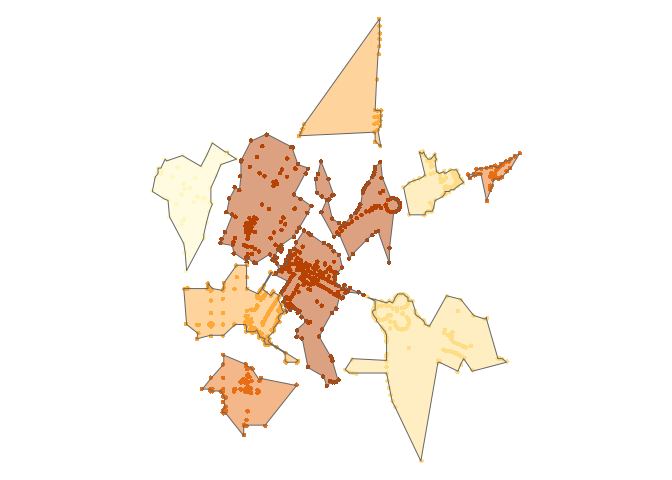

<!-- README.md is generated from README.Rmd. Please edit that file -->
concaveman
----------

[](https://travis-ci.org/joelgombin/concaveman)

A very fast 2D concave hull algorithm [in JavaScript by Vladimir Agafonkin](https://github.com/mapbox/concaveman), wrapped in R (generates a general outline of a point set).

``` r
library(concaveman)
library(dplyr)
#> 
#> Attaching package: 'dplyr'
#> The following objects are masked from 'package:stats':
#> 
#>     filter, lag
#> The following objects are masked from 'package:base':
#> 
#>     intersect, setdiff, setequal, union
library(purrr)
library(sf)
#> Linking to GEOS 3.5.0, GDAL 2.1.0, proj.4 4.9.2
library(tmap)
data(points)
polygons <- map(unique(points$k),
                       ~ concaveman(points[points$k %in% .,])
                       ) %>% 
  map2(unique(points$k), ~ mutate(.x, k = .y)) %>% 
  reduce(rbind)
tm_shape(points) +
 tm_dots(col = "k", size = 0.1, legend.show = FALSE) +
tm_shape(polygons) +
 tm_fill(col = "k", alpha = 0.5, legend.show = FALSE) +
 tm_borders() +
tm_layout(frame = FALSE)
```



### Installation

For now, `concaveman` can only be installed from github:

``` r
devtools::install_github("joelgombin/concaveman")
```

### Usage

``` r
library(concaveman)
library(dplyr)
library(purrr)
library(sf)
library(tmap)
data(points)
polygons <- concaveman(points)
polygons
#> Simple feature collection with 1 feature and 0 fields
#> Active geometry column: polygons
#> geometry type:  POLYGON
#> dimension:      XY
#> bbox:           xmin: -122.0844 ymin: 37.3696 xmax: -122.0587 ymax: 37.3942
#> epsg (SRID):    4326
#> proj4string:    +proj=longlat +datum=WGS84 +no_defs
#>                         polygons                       geometry
#> 1 POLYGON((-122.0809 37.3736,... MULTIPOINT(-122.08441 37.38...

polygons2 <- map(unique(points$k),
                 ~ concaveman(points[points$k %in% .,])
                 ) %>% 
  map2(unique(points$k), ~ mutate(.x, k = .y)) %>% 
  reduce(rbind)
tm_shape(points) +
 tm_dots(col = "k", size = 0.1, legend.show = FALSE) +
tm_shape(polygons2) +
 tm_fill(col = "k", alpha = 0.5, legend.show = FALSE) +
 tm_borders() +
tm_layout(frame = FALSE)
```


Signature: `concaveman(points, concavity = 2, lengthThreshold = 0)`

-   `points` Can be represented as a matrix of coordinates, an `sf` object or a `SpatialPoints*` object.
-   `concavity` is a relative measure of concavity. 1 results in a relatively detailed shape, Infinity results in a convex hull. You can use values lower than 1, but they can produce pretty crazy shapes.
-   `length_threshold`: when a segment length is under this threshold, it stops being considered for further detalization. Higher values result in simpler shapes.

### Algorithm

The algorithm is based on ideas from the paper [A New Concave Hull Algorithm and Concaveness Measure for n-dimensional Datasets, 2012](http://www.iis.sinica.edu.tw/page/jise/2012/201205_10.pdf) by Jin-Seo Park and Se-Jong Oh.

This implementation by Vladimir Agafonkin dramatically improves performance over the one stated in the paper (`O(rn)`, where `r` is a number of output points, to `O(n log n)`) by introducing a fast *k nearest points to a segment* algorithm, a modification of a depth-first kNN R-tree search using a priority queue.
