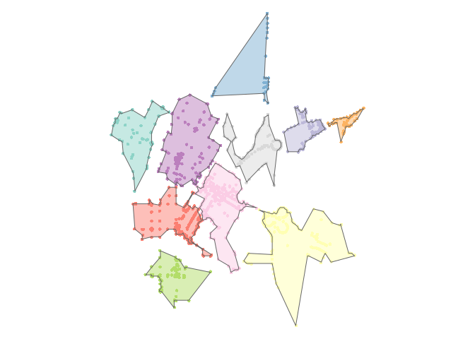

concaveman
----------

A very fast 2D concave hull algorithm [in JavaScript by Vladimir Agafonkin](https://github.com/mapbox/concaveman), wrapped in R (generates a general outline of a point set).



### Installation

For now, `concaveman` can only be installed from github:

``` r
devtools::install_github("joelgombin/concaveman")
```

### Usage

``` r
data(points)
points$k <- as.factor(points$k)
polygons <- concaveman(points, by = k)
```

    ## Warning in st_sf(x, ..., agr = agr): more than one geometry column: taking
    ## `polygons'; use `sf_column_name=' to specify a different column.

``` r
polygons
```

    ## Simple feature collection with 10 features and 1 field
    ## Active geometry column: polygons
    ## geometry type:  POLYGON
    ## dimension:      XY
    ## bbox:           xmin: -122.0844 ymin: 37.3802 xmax: -122.0785 ymax: 37.3873
    ## epsg (SRID):    4326
    ## proj4string:    +proj=longlat +datum=WGS84 +no_defs

    ## Warning in `st_geometry<-.data.frame`(`*tmp*`, value =
    ## structure(list(structure(list(: overwriting first sfc column

    ## Warning in st_sf(x): more than one geometry column: taking `polygons'; use
    ## `sf_column_name=' to specify a different column.

    ## # A tibble: 10 × 3
    ##         k          polygons          geometry
    ##    <fctr>  <simple_feature>  <simple_feature>
    ## 1       1 <POLYGON((-12...> <MULTIPOINT(-...>
    ## 2       2 <POLYGON((-12...> <MULTIPOINT(-...>
    ## 3       3 <POLYGON((-12...> <MULTIPOINT(-...>
    ## 4       4 <POLYGON((-12...> <MULTIPOINT(-...>
    ## 5       5 <POLYGON((-12...> <MULTIPOINT(-...>
    ## 6       6 <POLYGON((-12...> <MULTIPOINT(-...>
    ## 7       7 <POLYGON((-12...> <MULTIPOINT(-...>
    ## 8       8 <POLYGON((-12...> <MULTIPOINT(-...>
    ## 9       9 <POLYGON((-12...> <MULTIPOINT(-...>
    ## 10     10 <POLYGON((-12...> <MULTIPOINT(-...>

Signature: `concaveman(points, by = NULL, concavity = 2, lengthThreshold = 0)`

-   `points` is an `sf` object.
-   `by` is the (unquoted, tidyverse-style) name of the variable defining the subsets of points for which concave hull polygons should be computed. If `NULL` (the default), only one polygon is computed for the whole set of points.
-   `concavity` is a relative measure of concavity. 1 results in a relatively detailed shape, Infinity results in a convex hull. You can use values lower than 1, but they can produce pretty crazy shapes.
-   `length_threshold`: when a segment length is under this threshold, it stops being considered for further detalization. Higher values result in simpler shapes.

### Algorithm

The algorithm is based on ideas from the paper [A New Concave Hull Algorithm and Concaveness Measure for n-dimensional Datasets, 2012](http://www.iis.sinica.edu.tw/page/jise/2012/201205_10.pdf) by Jin-Seo Park and Se-Jong Oh.

This implementation by Vladimir Agafonkin dramatically improves performance over the one stated in the paper (`O(rn)`, where `r` is a number of output points, to `O(n log n)`) by introducing a fast *k nearest points to a segment* algorithm, a modification of a depth-first kNN R-tree search using a priority queue.
